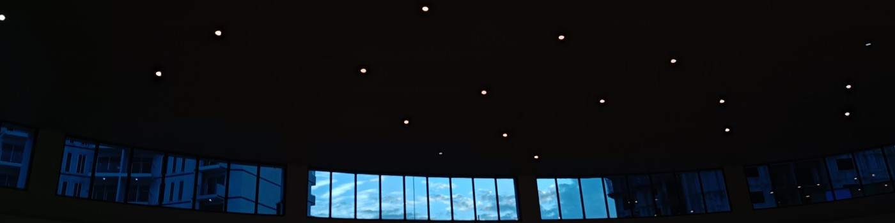

#                                                      Hi, I'm Syed Ashraf

**A Developer in the Making | Exploring AI, ML & Backend Systems**

---

## About Me

I'm a **Computer Science Student** passionate about building intelligent systems that make a real impact. My work spans across **AI/ML safety, backend engineering, and full-stack development**. I'm driven by curiosity and love solving complex problems through code.

**Currently:** Open to internships and collaborations in machine learning, AI safety, and backend systems engineering.

**Resume:** [Download](https://github.com/SyedAshraf49/Portfolio/blob/main/public/resume/asher-resume.pdf)

---

## Technical Skills

**Languages & Frameworks**

**ML & Data Science**

**Frontend & Styling**

**Tools & Platforms**

---

## Featured Projects

### Career Path Predictor
AI-powered career guidance platform with 91%+ accuracy using machine learning.

**Stack:** Python, Flask, Random Forest, Scikit-Learn  
**Features:** Career predictions, salary insights, personalized learning paths, responsive UI

[View Repository →](https://github.com/SyedAshraf49/Carrer-Path-Predictor-FI)

---

### HateShield AI
Production-grade content moderation platform for pre-publication review.

**Stack:** Python, Flask, Transformers, PyTorch  
**Features:** Text analysis, image moderation, audience sentiment analysis, risk scoring

[View Repository →](https://github.com/SyedAshraf49/HateSheildAI-V3)

---

### Interactive Portfolio
Modern personal portfolio built with React and TypeScript.

**Stack:** React 18, TypeScript, Tailwind CSS, Vite  
**Features:** Cosmic design, smooth animations, responsive layout

[Live Demo →](https://ashraf-portfolio49.vercel.app/) | [Repository →](https://github.com/SyedAshraf49/Portfolio)

---

## Get in Touch

**Email:** [galladeashraf@gmail.com](mailto:galladeashraf@gmail.com)

**GitHub:** [github.com/SyedAshraf49](https://github.com/SyedAshraf49)

**Portfolio:** [ashraf-portfolio49.vercel.app](https://ashraf-portfolio49.vercel.app/)

---

Made with ❤️ by Syed Ashraf  
Building intelligent systems, one line of code at a time.

